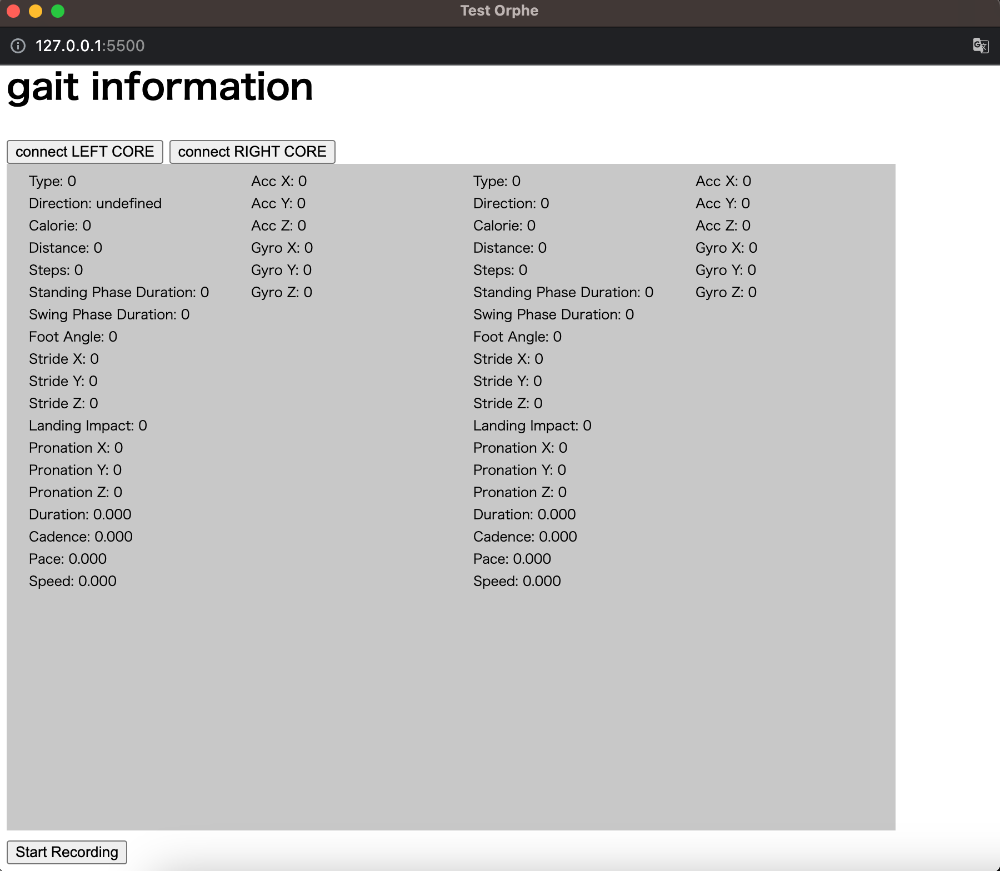

# OrpheResearchPersonal

Orphe を外部から接続できるようにして調査しやすくするための検証用 repository

# Installation

VSCode editor and "live server" extension

# Usage

1. git clone this project.
2. Open this project index.html via VSCode explorer.
3. Click "Go Live" button at the bottom of VSCode window.
4. Access http://127.0.0.1:5500 with chrome browser.
5. connect LEFT CORE and connect RIGHT CORE
6. click STart Recording

# Note

実装参考元：https://editor.p5js.org/kikukawayuya/sketches/D-NbsGfcE

https://orphe-oss.github.io/ORPHE-CORE.js/

https://orphe.io/column/post/report-of-gait-analyysis-evaluation#index_V2EiLSBf
